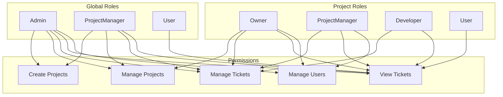

# Role-Based Access Control (RBAC) Implementation Plan

## Overview
This document outlines the implementation plan for a two-tier RBAC system for the BugTrack application, consisting of:
1. Global roles (Admin, ProjectManager, User)
2. Project-scoped roles (Owner, ProjectManager, Developer, User)

## Current State Analysis
Based on the code review, the application already has:
- Basic project role infrastructure in place
- Authorization handlers for project roles
- Project participant entity with role support
- Some authorization policies defined

## Implementation Plan

### Phase 1: Backend Implementation

#### 1.1 Global Role Implementation
**Tasks:**
- Add global role property to AppUser entity
- Create global role management endpoints
- Implement global role authorization policies
- Update JWT token to include global role

**Files to modify:**
- `Domain/AppUser.cs` - Add global role property
- `API/Controllers/UsersController.cs` - Add role management endpoints
- `API/Services/TokenService.cs` - Include global role in JWT
- `API/Program.cs` - Add global role policies

#### 1.2 Project Role Enhancement
**Tasks:**
- Enhance ProjectRoleHandler to support role hierarchy
- Add owner transfer functionality
- Implement role assignment restrictions
- Add role validation

**Files to modify:**
- `API/Authorization/ProjectRoleHandler.cs` - Enhance with hierarchy logic
- `API/Authorization/ProjectRoleRequirement.cs` - Add role hierarchy support
- `API/Controllers/ProjectsController.cs` - Add owner transfer endpoint
- `Application/Projects/UpdateParticipantRole.cs` - Add validation

#### 1.3 Ticket Authorization
**Tasks:**
- Add authorization attributes to all ticket endpoints
- Implement ticket-specific authorization handlers
- Add ticket assignment permissions based on roles

**Files to modify:**
- `API/Controllers/TicketsController.cs` - Add authorization attributes
- `API/Authorization/TicketAuthorizationHandler.cs` - New file
- `API/Authorization/TicketOperationRequirement.cs` - New file
- `API/Program.cs` - Add ticket authorization policies

### Phase 2: Frontend Implementation

#### 2.1 Global Role Management UI
**Tasks:**
- Create admin interface for managing global roles
- Add role display in user profiles
- Implement role-based navigation

**Files to modify/create:**
- `client-app/src/features/admin/UserManagement.tsx` - New file
- `client-app/src/app/layout/Navbar.tsx` - Add admin navigation
- `client-app/src/features/profiles/ProfilePage.tsx` - Display global role

#### 2.2 Project Role UI Enhancement
**Tasks:**
- Enhance project participant management UI
- Add owner transfer functionality
- Implement role-based UI visibility

**Files to modify:**
- `client-app/src/features/projects/details/ProjectParticipants.tsx` - Enhance UI
- `client-app/src/features/projects/details/ProjectAddParticipant.tsx` - Add role restrictions
- `client-app/src/app/stores/projectStore.ts` - Add role-based permissions

#### 2.3 Ticket Form Authorization
**Tasks:**
- Add role-based restrictions to ticket forms
- Implement ticket assignment UI based on roles
- Add role-based ticket action buttons

**Files to modify:**
- `client-app/src/features/tickets/form/TicketForm.tsx` - Add role restrictions
- `client-app/src/features/tickets/details/TicketDetails.tsx` - Role-based actions
- `client-app/src/app/stores/ticketStore.ts` - Add role checks

### Phase 3: Database & Seed Data

#### 3.1 Database Migration
**Tasks:**
- Create migration for global role property
- Add seed data for initial roles
- Create default admin user

**Files to modify:**
- `Persistence/DataContext.cs` - Update if needed
- Create new migration file

#### 3.2 Seed Data Enhancement
**Tasks:**
- Update seed data to include global roles
- Create sample users with different roles
- Add sample project participants with roles

### Phase 4: Testing & Validation

#### 4.1 Unit Tests
**Tasks:**
- Create unit tests for authorization handlers
- Test role hierarchy logic
- Test permission checks

#### 4.2 Integration Tests
**Tasks:**
- Test end-to-end role-based access
- Validate role assignment functionality
- Test admin operations

## Role Definitions & Permissions

### Global Roles
1. **Admin**
   - Full system access
   - Can manage global roles
   - Can access any project
   - Can transfer project ownership

2. **ProjectManager**
   - Can create projects
   - Becomes owner of created projects
   - Can manage project participants
   - Can manage all tickets in their projects

3. **User**
   - Basic access
   - Can view public content
   - Can be invited to projects

### Project-Scoped Roles
1. **Owner**
   - Full control over project
   - Can delete project
   - Can manage all participants
   - Can transfer ownership

2. **ProjectManager**
   - Can manage tickets
   - Can manage participants (except owner)
   - Cannot delete project
   - Cannot transfer ownership

3. **Developer**
   - Can create/edit tickets
   - Can view all project tickets
   - Can comment on tickets

4. **User**
   - Read-only access to project tickets
   - Can comment on tickets
   - Cannot edit tickets

## Implementation Priority
1. **High Priority**: Backend ticket authorization, global role implementation
2. **Medium Priority**: Frontend role management UI, project role UI enhancement
3. **Low Priority**: Admin panel polish, advanced features

## Mermaid Diagram: RBAC Architecture

## Next Steps
1. Implement global roles in the backend
2. Add ticket authorization
3. Create admin interface
4. Enhance project role UI
5. Add comprehensive testing

This plan provides a clear roadmap for implementing a robust RBAC system that meets the requirements of being simple yet solid for a portfolio project.