# 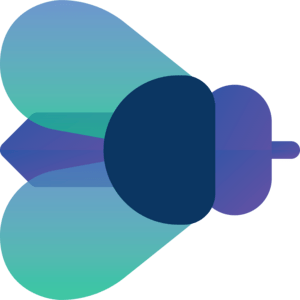 BugTrack — Full-Stack Issue Tracking System

[](https://dotnet.microsoft.com/download)
[](https://reactjs.org/)
[](https://www.typescriptlang.org/)
[](https://www.postgresql.org/)
[](https://opensource.org/licenses/MIT)
[](https://github.com/CiaranK87/BugTrack/actions)

> A full-stack issue tracker I use as a living codebase — somewhere to implement patterns I pick up at work and see how they hold up in a real, running application. Always in a working state; never a finished product.


## 🚀 Quick Demo

🔗 **[Live Demo](https://ckbugtrack-app01.vercel.app/)**

To explore the app without registering, use the following **Guest** credentials:
- **Email:** `demo@bugtrack.com` 
- **Password:** `Dem0Pa$$`

<br>

> The demo account has a global role of **Guest** and participates in three of the seeded projects with a different role on each — **Project Manager**, **Developer**, and **User**. This lets you explore how permissions and available actions shift by role without needing to register. Project creation and file uploads are restricted for the demo account; use the in-app access request form if you need full access.

> [!TIP]
> **See Real-time Updates (SignalR):** Open the app in two browser windows side-by-side. Post a comment on a ticket in one window—you'll see the notification and message appear instantly in the other without a page refresh.

---


## 📸 Screenshots

<p align="center">
    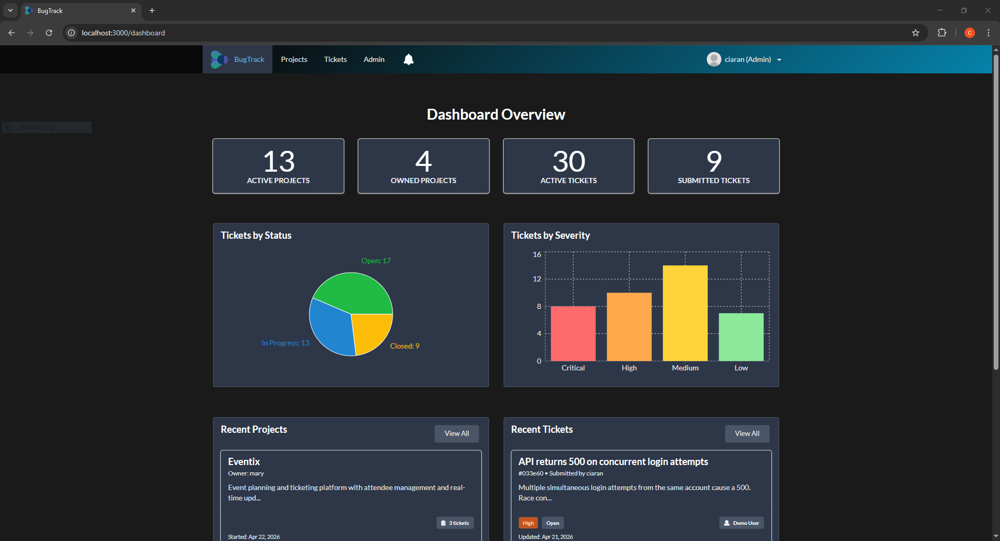
  </p>

<details>
  <summary><b>📸 Take the full tour (9 views)</b></summary>
  <br>

<details>
  <summary>🛡️ Admin Dashboard</summary>
  <br>
  <p align="center">
    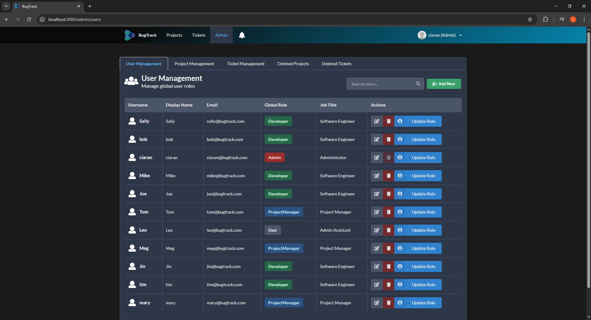
  </p>
</details>

<details>
  <summary>📁 Project Dashboard</summary>
  <br>
  <p align="center">
    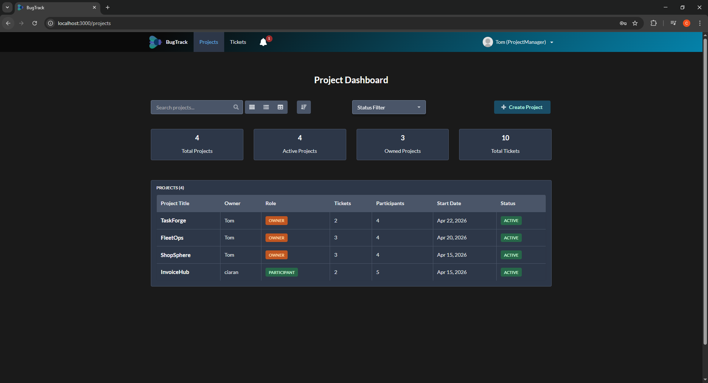
  </p>
</details>

<details>
  <summary>🔍 Project Details</summary>
  <br>
  <p align="center">
    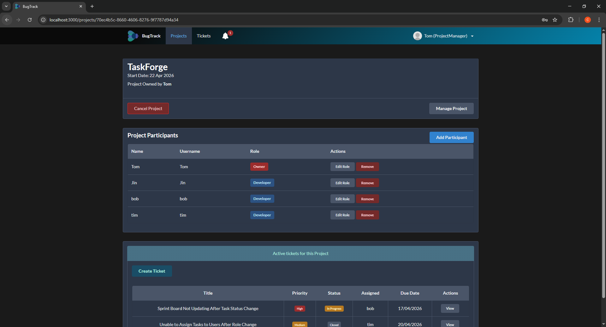
  </p>
</details>

<details>
  <summary>🗂️ Kanban Board</summary>
  <br>
  <p align="center">
    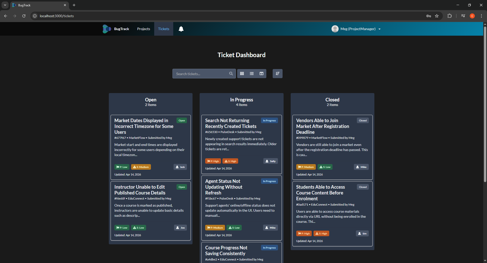
  </p>
</details>

<details>
  <summary>📋 Ticket List</summary>
  <br>
  <p align="center">
    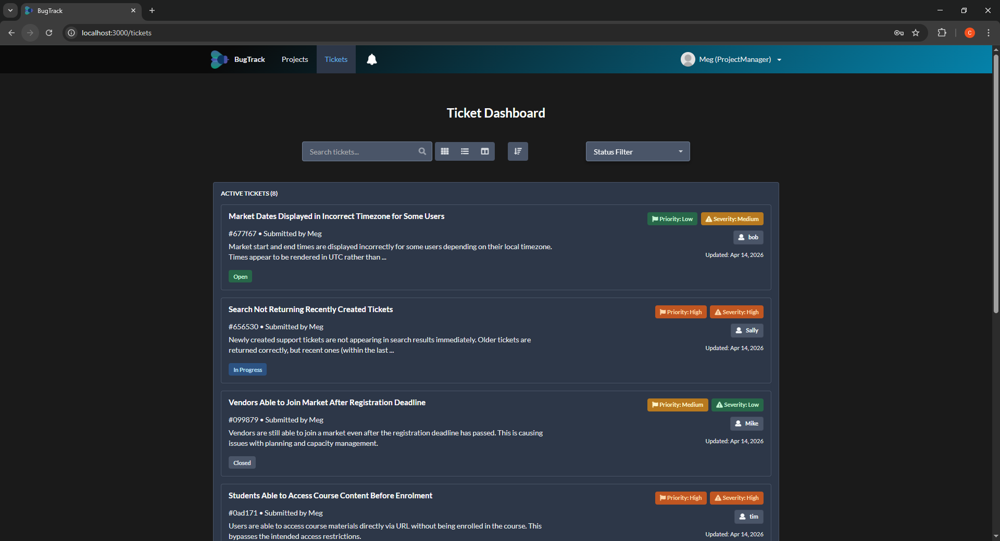
  </p>
</details>

<details>
  <summary>🎫 Ticket Details (InvoiceHub)</summary>
  <br>
  <p align="center">
    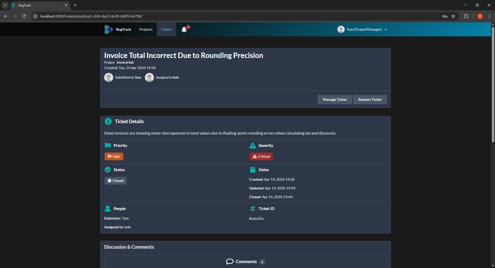
  </p>
</details>

<details>
  <summary>💬 Comments (EduConnect)</summary>
  <br>
  <p align="center">
    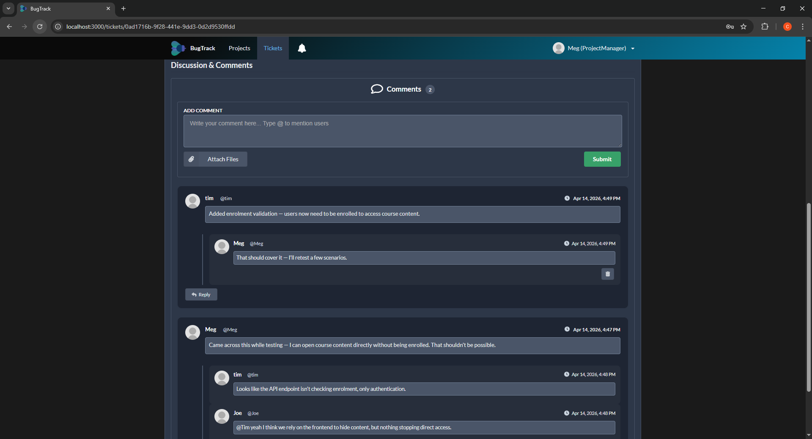
  </p>
</details>

<details>
  <summary>👤 User Profile</summary>
  <br>
  <p align="center">
    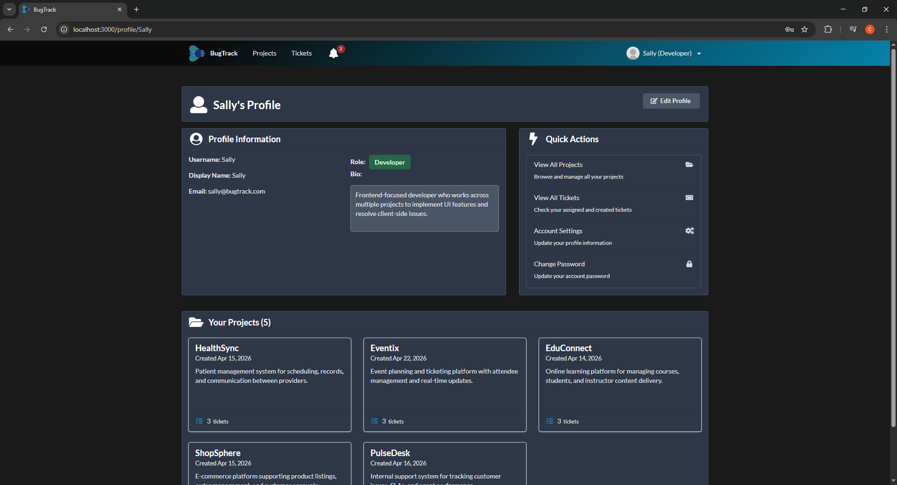
  </p>
</details>

<details>
  <summary>📱 Mobile Admin View</summary>
  <br>
  <p align="center">
    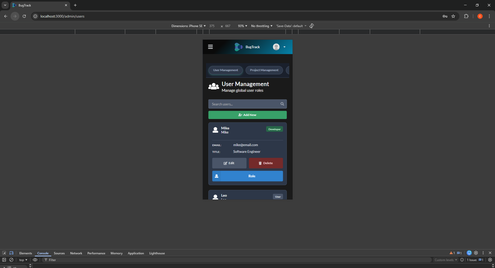
  </p>
</details>

</details>

---

## 🎯 About This Project

This codebase has grown organically: Clean Architecture and CQRS went in when I wanted to understand how they hold up across a full codebase, not just in isolated examples. The custom RBAC came from thinking through how project-level permissions actually differ from global ones. The test suite is there because I wanted to get comfortable with all four layers — unit, component, integration, and E2E — in a single project.

It's not a finished product, but it's always in a working state and I treat it with the same care I would professional code.

---

## 🏗️ Architecture Overview

The application is structured around the **Onion Model** (Clean Architecture), ensuring that the core business logic remains independent of the UI, database, and external libraries.

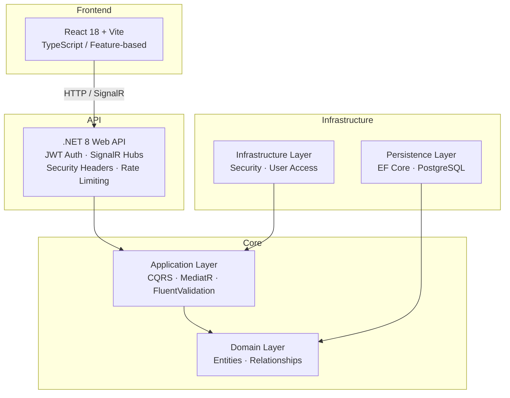

### Key Design Decisions

- **CQRS with MediatR**: Commands and queries are fully separated, keeping controllers thin and business logic independently testable. Adding a new feature means adding a handler, not modifying existing ones.
- **Result Pattern**: Service responses use a typed `Result<T>` instead of exceptions for flow control. This makes error paths explicit, improves performance, and keeps the controller logic predictable.
- **Custom Authorization Handlers**: Project-level roles (Owner, PM, Developer) extend beyond global permissions. A user can be a Developer on one project and a PM on another — handled via custom `IAuthorizationHandler` implementations.
- **Exception Middleware**: A single `ExceptionMiddleware` catches unhandled errors and returns consistent `AppException` responses across the API, rather than letting error formats vary by controller.
- **Security & Rate Limiting**: OWASP-recommended headers applied globally via middleware, alongside a `FixedWindowLimiter` (500 requests/min) at the API level — both small additions that meaningfully harden the surface area without requiring per-endpoint configuration. A passive OWASP ZAP baseline scan against the deployed frontend and API confirmed the API headers are solid; the main gap was the Vercel frontend, which now carries `X-Frame-Options`, `X-Content-Type-Options`, `Referrer-Policy`, `Permissions-Policy`, and a `Content-Security-Policy` tuned to the Vite/React bundle. Scan reports and triage notes are in `docs/security/`.
- **SignalR for Real-time**: Live comment threads and notifications give the app a responsive, collaborative feel without the overhead of polling.

### Operations

- **Migrations**: `context.Database.MigrateAsync()` runs on startup in `Program.cs`, so schema changes apply automatically on deploy — no manual migration step in the release process.
- **Structured Logging**: Serilog writes to stdout (Console sink only). In production on Azure Web App, this feeds into Azure's log stream and is accessible via Kudu. No file sink configured, so no ephemeral path concerns on restart.
- **Deployment**: GitHub Actions triggers on push to `main`, building and deploying to Azure Web App. Continuous deployment rather than tagged releases — a deliberate choice for a solo project where merges to `main` represent intended state.

---

## 🚀 Features

- **Project Management** — Multi-tier projects with role-based access (Owner, Project Manager, Developer).
- **Advanced Ticketing** — Full lifecycle management with priority levels, severity tracking, and status workflows.
- **Interactive Dashboard** — Data visualisation with charts showing ticket distribution and project health metrics.
- **Real-time Collaboration** — Live comment threads and instant notifications via SignalR.
- **Notifications System** — Full notification management with read/unread tracking, bulk actions, and real-time delivery.
- **User Profiles** — Editable user profiles with profile cards and activity views.
- **Admin Panel** — Centralised user and global role management for system administrators.
- **Contact / Access Request** — Public access request form with email notifications (Resend API) and file-based fallback logging.
- **File Attachments** — Upload and manage media files directly within bug reports.
- **Secure Auth** — JWT-based authentication with refresh token support.
- **Dark Mode** — Persistent dark theme across the entire UI.

---

## 🛠️ Tech Stack

### Backend (.NET 8)
- **Framework**: ASP.NET Core 8 (LTS)
- **Mediator**: MediatR
- **Mapping**: AutoMapper
- **Validation**: FluentValidation
- **Logging**: Serilog (Console sink)
- **ORM**: Entity Framework Core with PostgreSQL provider
- **Real-time**: SignalR
- **Auth**: ASP.NET Core Identity + JWT
- **API Docs**: Swagger / OpenAPI (Development)

### Frontend (React 18)
- **Framework**: React 18 with TypeScript
- **Build Tool**: Vite
- **State Management**: MobX + mobx-react-lite
- **UI Library**: Semantic UI React
- **Forms**: Formik + Yup
- **Data Visualisation**: Recharts
- **Drag & Drop**: dnd-kit
- **Structure**: Feature-based folder architecture for modularity and scalability

### Testing
- **Unit**: xUnit + Moq (Business rules and CQRS handlers)
- **Component**: Vitest + React Testing Library
- **Integration**: InMemory EF Core (API endpoint validation)
- **E2E**: Playwright (Full browser automation)

### DevOps / CI/CD
- **Backend Deployment**: GitHub Actions → Azure Web App
- **Frontend Deployment**: [Vercel](https://ckbugtrack-app01.vercel.app/)
- **Local Database**: Docker Compose (PostgreSQL)

---

## ⚡ Getting Started

### Prerequisites
- [.NET 8 SDK](https://dotnet.microsoft.com/download/dotnet/8.0)
- [Node.js v18+](https://nodejs.org/)
- [PostgreSQL 16](https://www.postgresql.org/download/) (or use the included Docker Compose)
- [Docker](https://www.docker.com/) *(optional, for local PostgreSQL)*

### Installation

```bash
# 1. Clone the repository
git clone https://github.com/CiaranK87/BugTrack.git
cd BugTrack

# 2. (Optional) Start PostgreSQL via Docker
cd API
docker compose up -d
cd ..

# 3. Configure environment variables (see Configuration below)

# 4. Start the API
cd API
dotnet restore
dotnet ef database update
dotnet run

# 5. Start the frontend
cd ../client-app
npm install
npm run dev
```

### Configuration

Create a `.env` file in the `API/` directory (see `appsettings.example.json` for the full configuration reference):

```env
# Required
DB_CONNECTION_STRING=Host=localhost;Database=BugTrack;Username=postgres;Password=your_password
TOKEN_KEY=your_super_secret_jwt_key_min_64_characters

# Optional — Contact / Access Request feature
CONTACT_ADMIN_EMAIL=your_admin_email@example.com
CONTACT_FROM_EMAIL=noreply@yourdomain.com
RESEND_API_KEY=your_resend_api_key
```

---

## 🧪 Testing

```bash
# Run all backend tests from the root directory
dotnet test

# Run frontend tests
cd client-app
npm test
```

The project maintains tests across four layers to ensure stability and correctness:

| Layer | Tool | Coverage |
|---|---|---|
| **Unit** | xUnit + Moq | Core business logic and MediatR handlers |
| **Component** | Vitest + React Testing Library | Frontend component behaviour |
| **Integration** | InMemory EF Core | API endpoint validation and data flow |
| **E2E** | Playwright | Critical user journeys and UI interactions |

---

## 🧗 Key Challenges

**Role-Based Access Control** — The most complex part of the backend. Global roles are straightforward, but modelling permissions that vary per project — and then writing tests that actually verify the boundaries hold — required significant iteration on the authorisation handlers. Getting the test coverage right here took longer than building the feature itself.

**Comment System** — What initially looked like a simple feature turned out to be one of the richest areas of the app. Threading, real-time updates, edit/delete permissions, and ownership rules all interact in ways that aren't obvious upfront. The gap between "comments work" and "comments feel right" was larger than expected.

**Mobile Responsiveness** — Issue trackers are almost exclusively used on desktop, so responsive support tends to go unnoticed by the people using the app. It's fully implemented and works well across screen sizes, but it's the kind of work that matters more as a baseline than as a feature — similar to accessibility or graceful error handling. You build it because it should be there, not because users will thank you for it.

---

## ⚖️ Trade-offs & Future Work

### Trade-offs Made
- **Clean Architecture Boilerplate**: The layered structure adds initial setup complexity, but it pays off in a team setting: changes stay isolated, testing is straightforward, and the codebase is easy to navigate as it grows.
- **PostgreSQL over SQLite**: Opted for PostgreSQL to support advanced indexing and features that would matter at scale, though it requires more setup than SQLite for local development.

### Planned Improvements
- [ ] **Multitenancy**: Implementing data isolation to support multi-client project hosting.
- [ ] **Azure Blob Storage**: Replace local storage for production-grade scalability.
- [ ] **Full Docker Compose**: Extend the existing database container setup to include the API and frontend for one-command local startup.

---

## 📄 License

Distributed under the [MIT License](LICENSE).